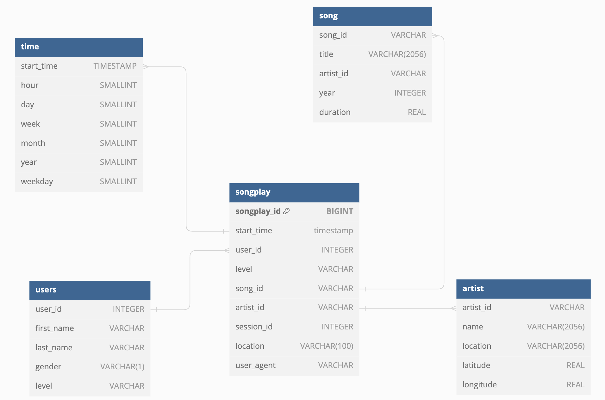

# ETL pipeline for the music streaming service

The project's python scripts are needed for the ETL pipeline that loads streaming service's log data and Million Songs Dataset from AWS S3 Bucket to dimensional tables in AWS Redshift.



## Dependencies

Install `configparser` and `psycopg2` python packages to your environment.

## Config

Place in the `dwh.cfg` file the next variables:

`HOST` - hostname for your Redshift cluster.  
`ARN` - your ARN role that is connected to the Redshift cluster  
`KEY` - key for your AWS account to call it's API  
`SECRET` - secret for the AWS key to call AWS API

## Tables creation

Run

```
python create_tables.py
```

This script deletes and creates schema with staging and final tables.

Tables list:

### Staging tables:

- log_data
- song_data

### Final tables:

- songplay
- users
- song
- artist
- time

## Transfer data from S3

Run

```
python etl.py
```

This script:

1. Runs `copy` commands that load data from S3 bucket `udacity-dend` to the Redshift cluster into staging tables.
2. Runs sql `insert` commands to transfer data from the staging tables to final star schema.

The script prints to console size of the tables after the `copy` and `insert` statements.

## Check your data

Run

```
python check.py
```

This script makes basic SQL `select` statements from resulting tables to analyze the data.
